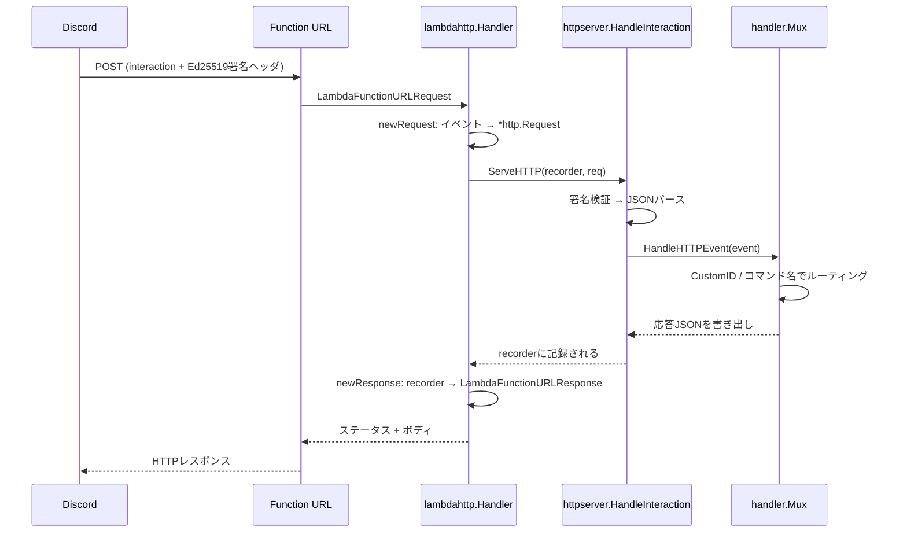

## HTTP InteractionsをAWS Lambdaで受ける実装メモ

[disgo](https://github.com/disgoorg/disgo) + Lambda Function URLでHTTP Interactionsを処理する部分の実装メモ。

## 処理の流れ



パッケージの担当:

| パッケージ          | 担当                                          |
| ------------------- | --------------------------------------------- |
| cmd/bot             | Lambdaエントリポイント                        |
| internal/discordbot | disgoクライアントと署名検証ハンドラの組み立て |
| internal/lambdahttp | Function URLイベント ⇄ `net/http`の変換       |
| internal/commands   | コマンド定義とルーティング                    |

署名検証・インタラクションのパース・応答の書き出しはdisgoの`httpserver.HandleInteraction`が持っている。
自前で書くのはLambdaイベントと`net/http`の変換だけ。

## cmd/bot/main.go

`/cmd/bot/main.go`:

```go
package main

import ...

var (
	handle lambdahttp.HandlerFunc
)

func init() {
	slog.SetDefault(slog.New(slog.NewJSONHandler(os.Stderr, nil)))

	cfg, err := discordbot.LoadConfig()
	if err != nil {
		slog.Error("load config", slog.Any("err", err))
		os.Exit(1)
	}

	_, h, err := discordbot.New(cfg)
	if err != nil {
		slog.Error("initialize bot", slog.Any("err", err))
		os.Exit(1)
	}
	handle = lambdahttp.Handler(h)
}

func main() {
	lambda.Start(handle)
}
```

設定ロードとクライアント生成を`init()`に配置し、コールドスタート時に一度だけ実行させる。

`lambda.Start`に渡しているのは`lambdahttp.HandlerFunc`。
`http.Handler`をそのまま渡すことはできないので、後述のアダプタで包んでいる。

## internal/discordbot/config.go

`/internal/discordbot/config.go`:

```go
package discordbot

import (
	"github.com/caarlos0/env/v11"
)

type Config struct {
	BotToken  string `env:"DISCORD_BOT_TOKEN,required"`
	PublicKey string `env:"DISCORD_PUBLIC_KEY,required"`
}

func LoadConfig() (*Config, error) {
	cfg := &Config{}
	if err := env.Parse(cfg); err != nil {
		return nil, err
	}

	return cfg, nil
}
```

[caarlos0/env](https://github.com/caarlos0/env)を使って環境変数をロードしている。

## internal/discordbot/bot.go

`/internal/discordbot/bot.go`:

```go
package discordbot

import ...

// NewClient は、インタラクションのルートを登録したdisgoクライアントを作成する。
func NewClient(cfg *Config) (*bot.Client, error) {
	r := handler.New()
	commands.RegisterRoutes(r)

	client, err := disgo.New(cfg.BotToken,
		bot.WithLogger(slog.Default()),
		bot.WithEventListeners(r),
	)
	if err != nil {
		return nil, fmt.Errorf("create disgo client: %w", err)
	}
	return client, nil
}

// New は、クライアントと、Discordから届くインタラクションを検証して振り分けるhttp.Handlerを返す。
func New(cfg *Config) (*bot.Client, http.Handler, error) {
	key, err := hex.DecodeString(cfg.PublicKey)
	if err != nil {
		return nil, nil, fmt.Errorf("decode public key: %w", err)
	}

	client, err := NewClient(cfg)
	if err != nil {
		return nil, nil, err
	}

	h := httpserver.HandleInteraction(httpserver.DefaultVerifier{}, key, client.Logger, client.EventManager.HandleHTTPEvent)

	return client, h, nil
}
```

WebSocket接続は不要なため`client.OpenGateway(ctx)`は呼ばない。
`bot.WithEventListeners(r)`で`handler.Mux`をリスナとして刺しておくと、HTTP経由で入ってきたインタラクションがここに流れる。

`httpserver.HandleInteraction`が返すのはただの`http.Handler`で、中で

1. `X-Signature-Ed25519`/`X-Signature-Timestamp`ヘッダとボディでEd25519署名を検証
2. JSONをインタラクションにパース
3. `client.EventManager.HandleHTTPEvent`を別goroutineで呼び、応答をチャネルで待つ
4. 返ってきた応答を`http.ResponseWriter`に書き出す

を行う。

`NewClient`と`New`を分けてあるのは、コマンド登録処理はクライアントだけを使うため。

## internal/commands/

`/internal/commands/commands.go`:

```go
package commands

import ...

var Commands = []discord.ApplicationCommandCreate{
	pingCommand,
}

func RegisterRoutes(r *handler.Mux) {
	r.SlashCommand("/ping", handlePing)
}
```

`Commands`はDiscordに登録する定義のリスト。
`RegisterRoutes`は届いたインタラクションの振り分け。

`/internal/commands/ping.go`:

```go
package commands

import ...

var pingCommand = discord.SlashCommandCreate{
	Name:        "ping",
	Description: "Responds with pong",
	DescriptionLocalizations: map[discord.Locale]string{
		discord.LocaleJapanese: "pongと返します",
	},
	IntegrationTypes: []discord.ApplicationIntegrationType{
		discord.ApplicationIntegrationTypeGuildInstall,
		discord.ApplicationIntegrationTypeUserInstall,
	},
	Contexts: []discord.InteractionContextType{
		discord.InteractionContextTypeGuild,
		discord.InteractionContextTypeBotDM,
	},
}

func handlePing(_ discord.SlashCommandInteractionData, e *handler.CommandEvent) error {
	return e.CreateMessage(
		discord.NewMessageCreate().
			WithContent("pong").
			WithEphemeral(true),
	)
}
```

## internal/lambdahttp/adapter.go

ここが自前で書いている本体。
Function URLのイベントと`net/http`の相互変換。

```go
package lambdahttp

import ...

// HandlerFunc は、Function URL経由で呼ばれる関数としてlambda.Startが期待する型
type HandlerFunc func(context.Context, events.LambdaFunctionURLRequest) (events.LambdaFunctionURLResponse, error)

// Handler は、http.HandlerをLambda Function URLから呼べる形に包む。
func Handler(h http.Handler) HandlerFunc {
	return func(ctx context.Context, req events.LambdaFunctionURLRequest) (events.LambdaFunctionURLResponse, error) {
		r, err := newRequest(ctx, req)
		if err != nil {
			slog.Error("build http request from lambda event", slog.Any("err", err))
			return events.LambdaFunctionURLResponse{
				StatusCode: http.StatusBadRequest,
				Headers:    map[string]string{"Content-Type": "text/plain; charset=utf-8"},
				Body:       "Bad Request",
			}, nil
		}

		rec := httptest.NewRecorder()
		h.ServeHTTP(rec, r)
		return newResponse(rec), nil
	}
}
```

### newRequest: イベント → *http.Request

```go
func newRequest(ctx context.Context, req events.LambdaFunctionURLRequest) (*http.Request, error) {
	body := []byte(req.Body)
	if req.IsBase64Encoded {
		// Function URLがボディをバイナリ扱いするとbase64で届く
		decoded, err := base64.StdEncoding.DecodeString(req.Body)
		if err != nil {
			return nil, fmt.Errorf("decode base64 body: %w", err)
		}
		body = decoded
	}

	method := req.RequestContext.HTTP.Method
	if method == "" {
		method = http.MethodPost
	}

	target := req.RawPath
	if !strings.HasPrefix(target, "/") {
		target = "/" + target
	}
	if req.RawQueryString != "" {
		target += "?" + req.RawQueryString
	}

	r, err := http.NewRequestWithContext(ctx, method, "http://lambda"+target, bytes.NewReader(body))
	if err != nil {
		return nil, fmt.Errorf("new request: %w", err)
	}

	for k, v := range req.Headers {
		r.Header.Set(k, v)
	}
	if len(req.Cookies) > 0 {
		r.Header.Set("Cookie", strings.Join(req.Cookies, "; "))
	}
	r.RemoteAddr = req.RequestContext.HTTP.SourceIP
	r.ContentLength = int64(len(body))

	return r, nil
}
```

### newResponse: recorder → イベント

```go
func newResponse(rec *httptest.ResponseRecorder) events.LambdaFunctionURLResponse {
	headers := make(map[string]string, len(rec.Header()))
	for k, v := range rec.Header() {
		headers[k] = strings.Join(v, ", ")
	}

	status := rec.Code
	if status == 0 {
		status = http.StatusOK
	}

	// 通常の応答はJSONだが、添付ファイル付き応答はmultipartのバイナリになる
	// そのまま文字列にすると壊れるのでbase64に逃がす
	body := rec.Body.Bytes()
	if !utf8.Valid(body) {
		return events.LambdaFunctionURLResponse{
			StatusCode:      status,
			Headers:         headers,
			Body:            base64.StdEncoding.EncodeToString(body),
			IsBase64Encoded: true,
		}
	}

	return events.LambdaFunctionURLResponse{
		StatusCode: status,
		Headers:    headers,
		Body:       string(body),
	}
}
```

## cmd/syncommands/main.go

コマンド定義をDiscordに登録する単発CLI。

```go
if err := godotenv.Load(); err != nil {
	if !os.IsNotExist(err) {
		return fmt.Errorf("load .env: %w", err)
	}
}

cfg, err := discordbot.LoadConfig()
// ...
client, err := discordbot.NewClient(cfg)
// ...
if _, err := client.Rest.SetGlobalCommands(client.ApplicationID, commands.Commands); err != nil {
	return fmt.Errorf("sync commands: %w", err)
}
```
